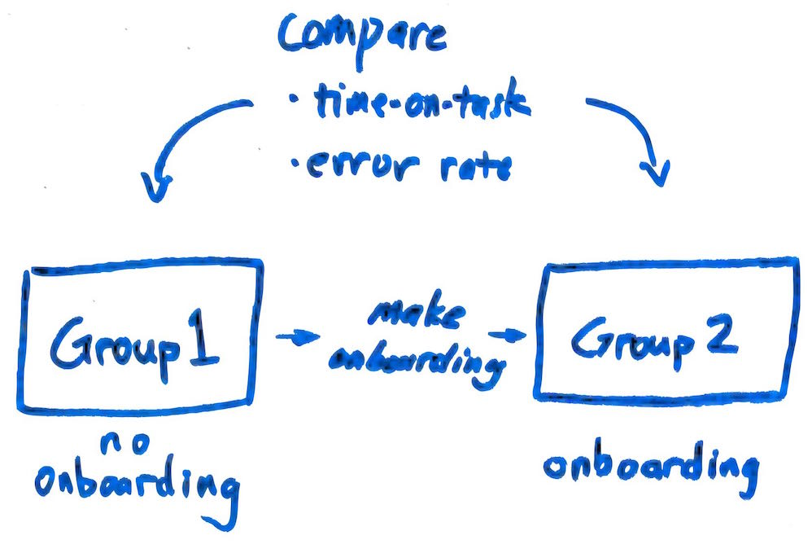
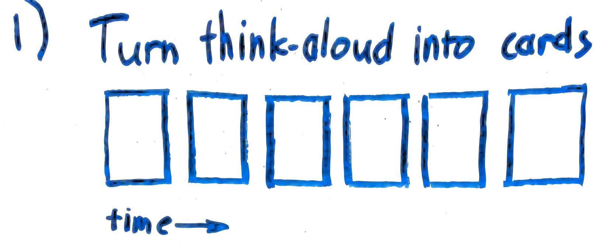
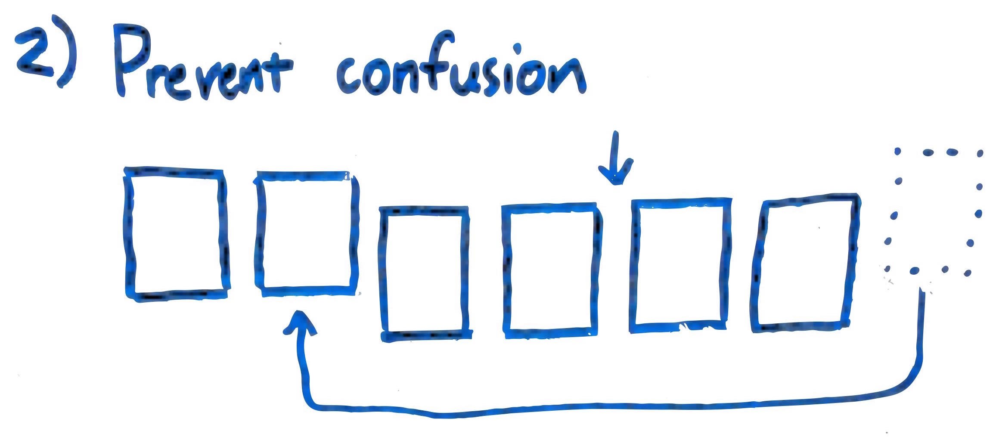
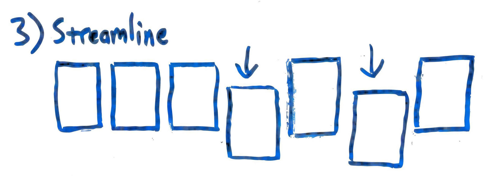
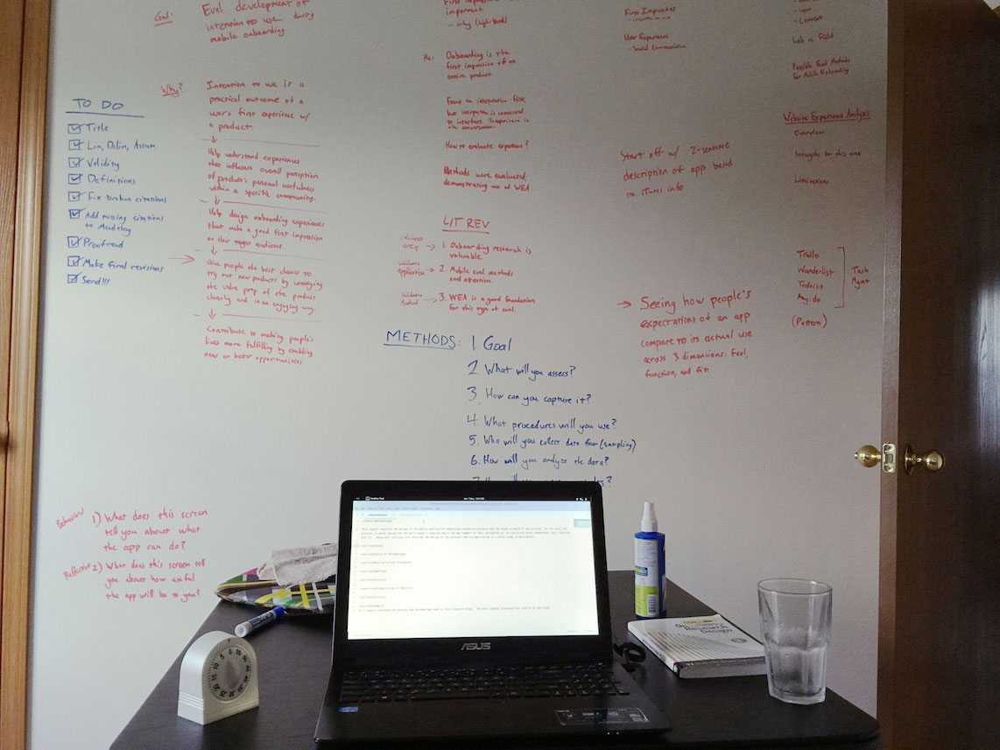

## Methodology

### Overview
I researched existing methods for eliciting design insights and current trends of onboarding experience design. Then I proposed an **iterative, 3-step research protocol** based around co-design:
1. A **short interview** helps researchers learn more about the participant’s attitudes and prior experiences related to onboarding.
2. A **think-aloud session** performing tasks with a prototype of the app creates a lived experience of using and learning about the app.
3. A **[CARD co-design session](http://pro.sagepub.com/content/37/4/295.short)** allows the researcher and participant to improve that experience by representing it as a line of cards and reorganizing it to remove issues.

	<figure style="top: -11em;">
		
		<figcaption>
			How I'll validate the protocol
		</figcaption>
	</figure>

I'm going to do **two iterations** of the protocol to validate it for my thesis research, but it can be run as many times as is needed.

### My CARD Variant
My major contribution was a variant of the CARD method for evaluating onboarding flows. It was designed to allow participants to leverage their lived experience using the app without getting bogged down in the details of interface design.

The variant used six types of **cards to represent events**:

1. Setting a goal
2. Completing a goal
3. Learning something new
4. Evaluating something
5. Positive reaction
6. Negative reaction

Each card has a few examples and a space to write specific details.

Researcher and participant **review the recording** of the think-aloud session and **lay cards down in a line** to match the events in the recording. Then they look for patterns where the participant ran into problems and try to remove and reorder the cards to provide a better experience.

	<figure style="top: -29em;">
		
		<figcaption>
			CARD variant - step 1
		</figcaption>
	</figure>

	<figure style="top: -19em;">
		
		<figcaption>
			CARD variant - step 2
		</figcaption>
	</figure>

	<figure style="top: -9em;">
		
		<figcaption>
			CARD variant - step 3
		</figcaption>
	</figure>

## Research Highlights

	<figure style="top: 4em;">
		
		<figcaption>
			My workspace during a writing spree
		</figcaption>
	</figure>

### Theoretical Framing
I used **phenomenology** and **constructivism** as lenses to look at my research area.

Phenomenology explores people's lived experiences of events or interactions. That focused my work on **people's interactions with mobile onboarding** and not their opinions or something about the interfaces themselves.

Constructivism deals with finding meaning. It states that meaning is created dynamically when people interact with things, so I needed to investigate **during an interaction and immediately afterwards** to see how people learned to use the interface and what parts they cared about.

### Minimalist Instruction
My methodology was inspired by **John Carroll**’s work at the IBM Watson Research Center in the 80’s and 90's. He was trying to help people transition to desktop computers before many interaction design practices were established. Carroll believed that it was impossible to create good instructions on the first try, so he stressed the importance of **iterative design** and **learning from your participants**. I tried to preserve the spirit of his research in my protocol.

You can read more about Carroll's work on [InstructionalDesign.org](http://www.instructionaldesign.org/theories/minimalism.html) and about minimalism in general on [NN/g](https://www.nngroup.com/articles/roots-minimalism-web-design/).

### The CARD Method
The [CARD method](http://pro.sagepub.com/content/37/4/295.short) was created by Tudor and Mueller at Bell Labs in the 90’s. It is a participatory task analysis and redesign method that uses cards to abstract the steps in task flows. Working with cards instead of interfaces helps users work at a comfortable level of abstraction.
