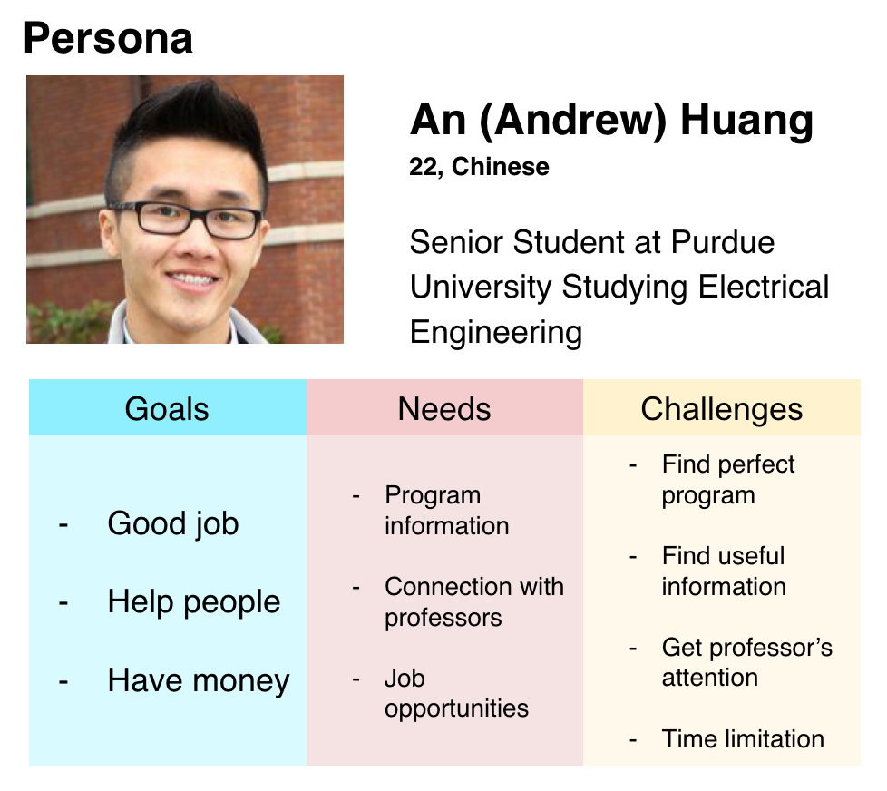
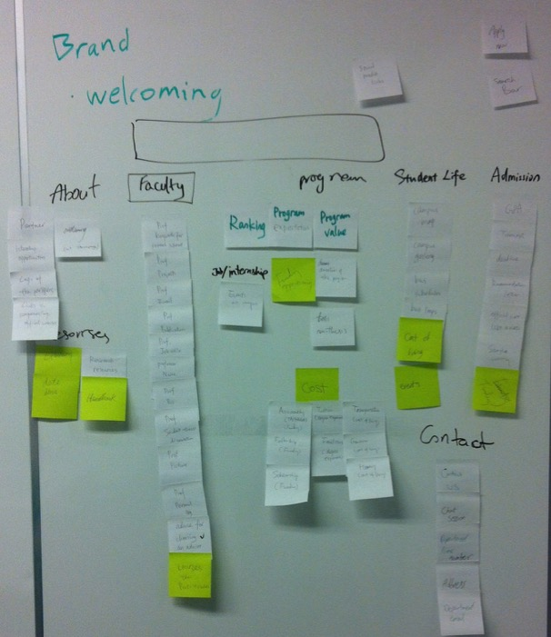
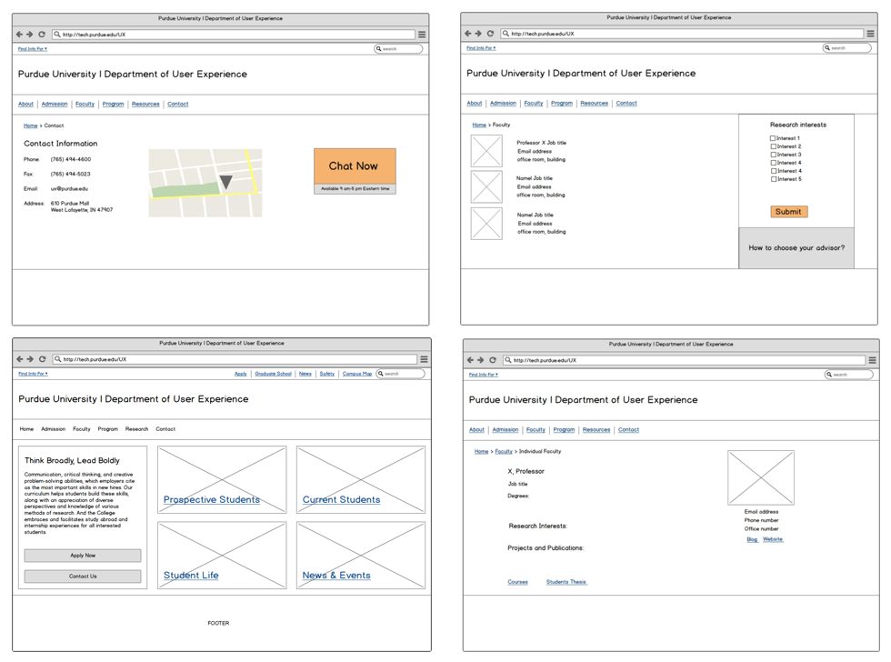
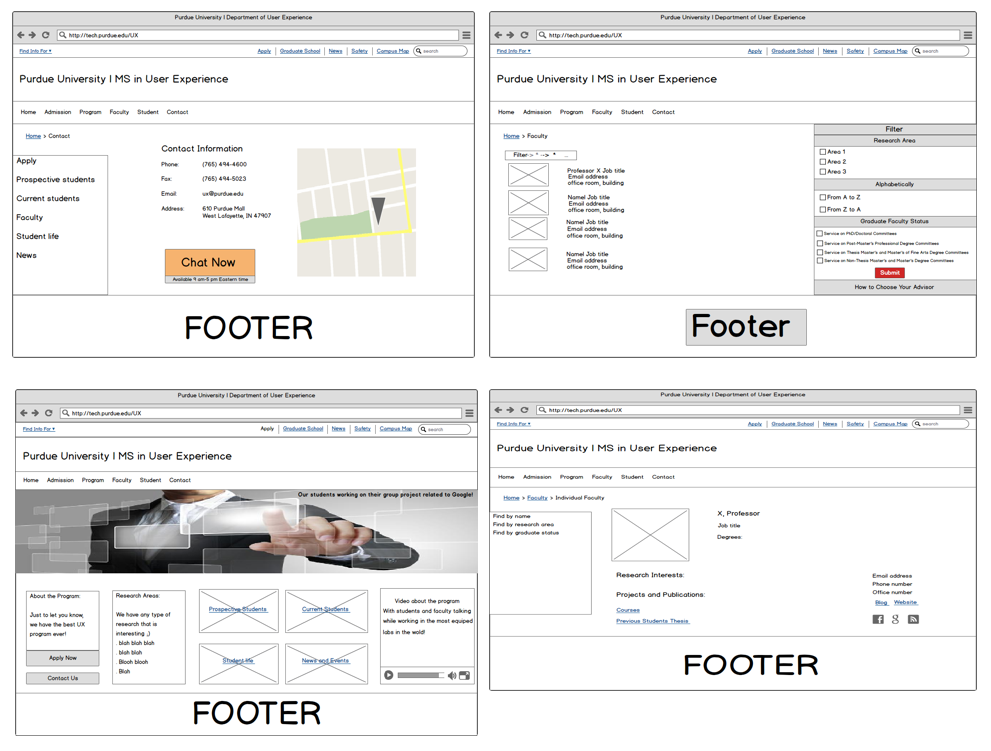
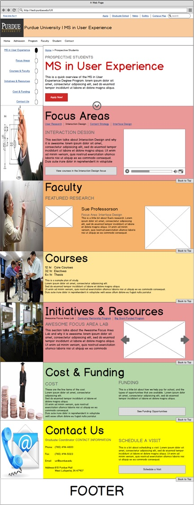

## Process

### Plan
We started by clarifying the situation and goals with our stakeholder.  The site needed to be CMS-friendly, but we were told to focus on students for this project, not content creators.  We decided to do **semi-structured interviews** to understand the factors that influence prospective grad students, and **think-aloud usability tests** with a prototype to help validate our design choices.

### Understand
We reached out to our networks and recruited six potential grad students for interviews. Three were undergraduate students and three were professionals, but all were in their early 20s. We asked them questions about their **work and life goals**, **how grad school might be a part of those goals**, and **their search for graduate programs** for about an hour.

	<figure style="top: -2em;">
		
		<figcaption>
			We performed a thematic analysis of the interview transcripts using affinity&nbsp;diagramming
		</figcaption>
	</figure>

We identified one persona, an undergraduate senior named Andrew, and wrote out a detailed **persona** and **scenarios** for him.

<figure>
	
	<figcaption>
		The overview of our persona
	</figcaption>
</figure>

We had expected to find one persona for students and another for professionals, but we found no clear distinction between the answers.  We now believe that being around the same age was a bigger factor for our participants.

### Make

	<figure style="top: 1em;">
		
		<figcaption>
			The information architecture
		</figcaption>
	</figure>

We used the major groups from our affinity diagram to decide on the site's **information architecture**.  Then we **sketched out ideas** individually and then combined our best ideas together.  Once we had settled on the content, we tweaked the layout to fit with Purdue's branding guidelines.

	<figure style="top: 14em;">
		
		<figcaption>
			Rough sketches
		</figcaption>
	</figure>

We used Balsamiq to create a **clickable wireframe prototype** for usability testing.

<figure>
	
	<figcaption>
		Initial wireframes.  Clockwise from top-left: Contact, Faculty directory, Faculty detail, Home.
	</figcaption>
</figure>

### Validate
We did **two rounds of usability testing** with our prototype in order to refine the design.  Four people in our target audience were in the first test, and five were in the second.  Each person performed a think-aloud protocol while they looked for admission criteria, information about a specific professor, and research opportunities.

We asked a pre- and post-task question to compare expected and actual difficulty for each of the tasks and noted when the participant backtracked or made an error during each task.  We resolved issues with presenting admission criteria after the first round of testing, and participants in the second round reported **slightly lower difficulty** and **fewer errors overall**.

<figure>
	
	<figcaption>
		Revised wireframes.  Clockwise from top-left: Contact, Faculty directory, Faculty detail, Home.
	</figcaption>
</figure>

## Outcomes
We wrote everything up in a report and gave a presentation to our stakeholder. He was very pleased with our work and used the project as part of a larger proposal to standardize graduate degree pages. Unfortunately, that effort was derailed by bureaucracy.

<figure>
	
	<figcaption>
		Final home page wireframe.
	</figcaption>
</figure>

<figure>
	
	<figcaption>
		Final overview page wireframe.
	</figcaption>
</figure>

----

### Team
- Mihaela Vorvoreanu &mdash; Faculty Mentor
- Eli Allameh &mdash; Masters Student
- Mina Ostavari &mdash; Masters Student
- Brendan Strahm &mdash; Masters Student
- Liang Zhao &mdash; Masters Student
