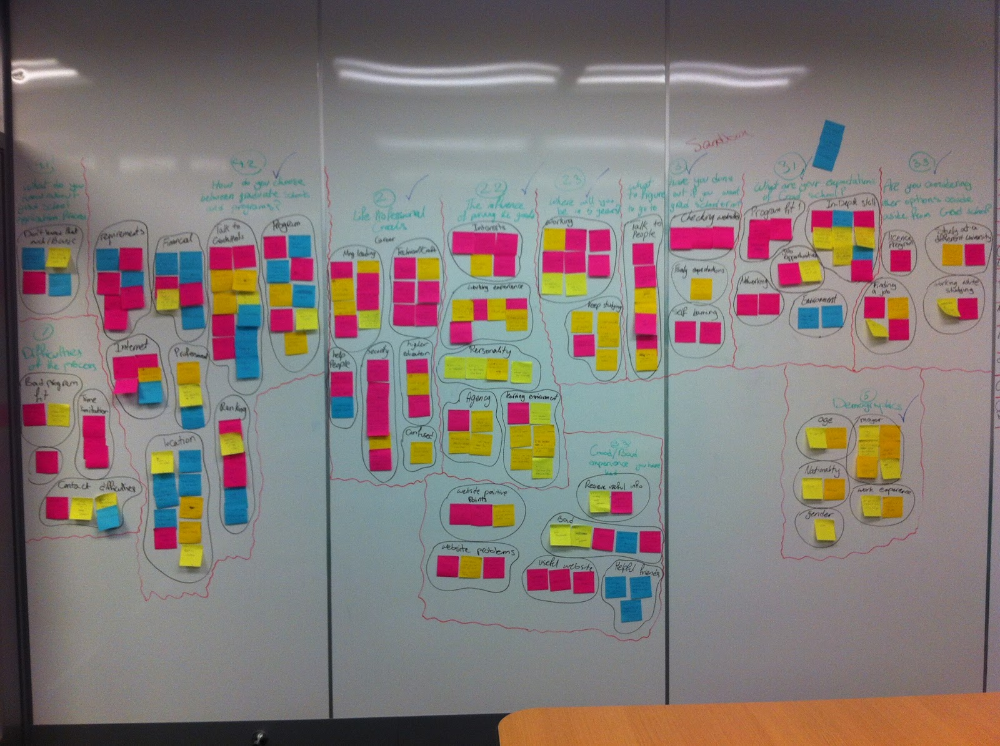
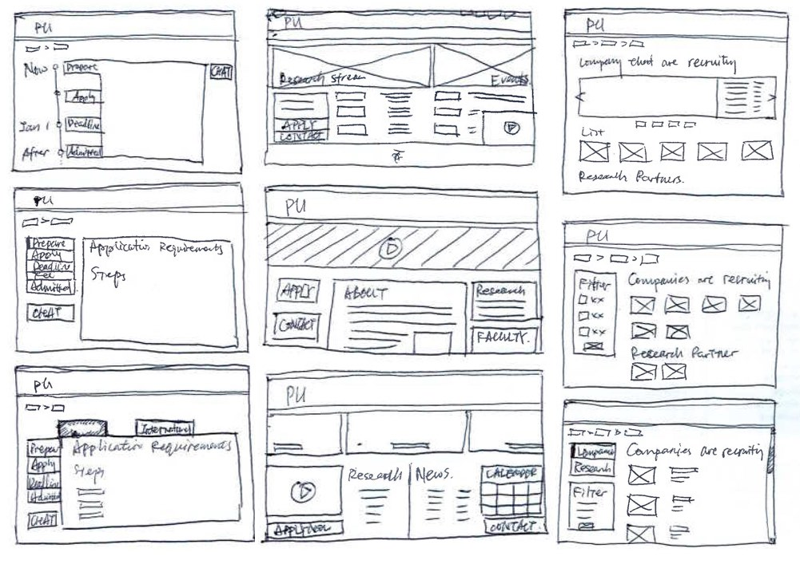
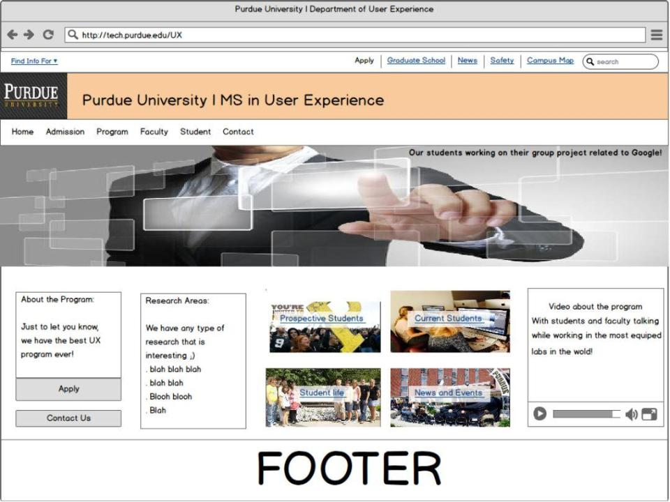

## Process
We started by clarifying the situation and goals with our stakeholder and used that feedback to create a plan for research and design.

### Formative Research
We reached out to our networks and recruited six potential grad students for semi-structured interviews. Three were undergraduate students and three were professionals, but all were in their early 20s. We asked them questions about their work and life goals, how grad school might be a part of those goals, and their search for graduate programs.

	<figure style="top: -10em;">
		
		<figcaption>
			We used an affinity diagram to perform a thematic analysis
		</figcaption>
	</figure>

We identified one persona, an undergraduate senior named Andrew. He wanted career fit, opportunities for advancement, and stability, but was having trouble finding a graduate program that would be a good fit due to lack of information about programs and their corporate partnerships.

### Ideation

We sketched out ideas individually and created some refined sketches collaboratively from the best ideas, making sure they fit with Purdue's branding guidelines.

	<figure style="top: -6em;">
		
		<figcaption>
			Rough sketches
		</figcaption>
	</figure>

Then we made wireframes in Balsamiq and linked them together into a clickable prototype.

<figure>
	
	<figcaption>
		Homepage Wireframe
	</figcaption>
</figure>

### Evaluative Research
We did two rounds of usability testing with our prototype in order to refine the design.  Four people were in the first test, and five were in the second.  Each person performed a think-aloud protocol while they looked for admission criteria, information about a specific professor, and research opportunities.

Along with looking for general usability issues, we asked a pre- and post-task question to compare expected and actual difficulty for each of the tasks and counted errors made during each task.  We were able to resolve issues with admission criteria between rounds of testing, and participants reported slightly lower difficulty and a better experience overall in the second round.

## Outcomes
We wrote everything up in a report and gave a presentation to our stakeholder. He was very pleased with our work and used the project as part of a larger proposal to standardize graduate degree pages. Unfortunately, that effort was derailed by bureaucracy.

----

### Team
- Mihaela Vorvoreanu &mdash; Faculty Mentor
- Eli Allameh &mdash; Masters Student
- Mina Ostavari &mdash; Masters Student
- Brendan Strahm &mdash; Masters Student
- Liang Zhao &mdash; Masters Student
