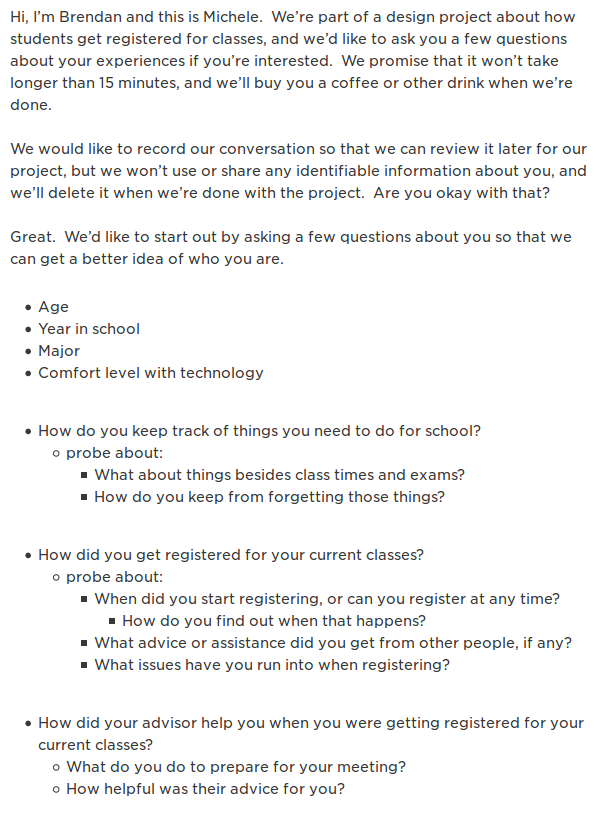
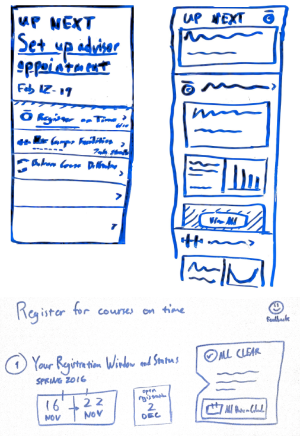
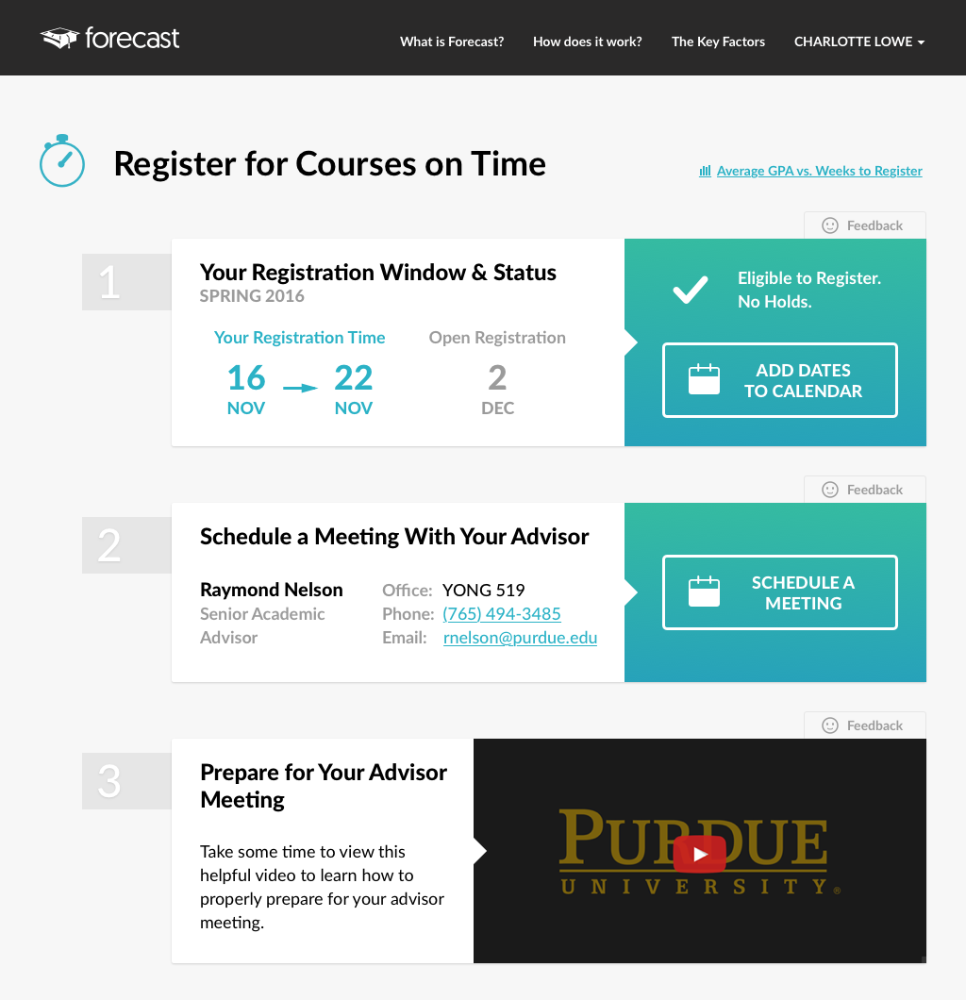

## My Role
I led the research for this project and created the final iteration of the mockup.

## Process

### Plan
We needed to learn about student registration experiences, but we only had a few days. Contextual inquiry would let us probe about the pain points in the process as they happen, but registration had closed a couple weeks ago. I proposed we do short **semi-structured interviews** at the Starbucks on campus instead. We wouldn't get the detail of an observation, but we could **learn about past experiences** and **get participants quickly**.

I wrote an interview script that focused on:
- General scheduling habits and artifacts.
- How they got registered for their current classes.
- Their advisor meeting and how they prepared.

	<figure style="top: -19em;">
		
		<figcaption>
			Semi-structured interview script
		</figcaption>
	</figure>

### Understand
We interviewed five students for 10-15 minutes each and got a few initial impressions:
- Most of the students used their **phone's calendar** or a **school management app** to keep track of things.
- All the students were **happy with the information from their advisors** and the notifications they got over email.
- A few students rarely checked their school email.
- Classes were filled up very quickly for some majors.  **Email wasn't fast enough** for notifications when registration opened.

### Make
We focused our design around two points:
- Displaying upcoming events.
- Providing reminders through calendar integration and text messages.

<figure>
	
	<figcaption>
		Some sketches of interface ideas.  The project covers more than just registration, so our designs needed to be flexible.
	</figcaption>
</figure>

## Outcomes
I created the final mockup in Sketch, matching the existing look and feel for the project.  We sent it to our stakeholders, and it was approved for development.

<figure>
	
	<figcaption>
		The final mockup
	</figcaption>
</figure>

----

### Team
- Alex Kingman &mdash; Project Manager
- Michele Rund &mdash; Visual Designer
- Brendan Strahm &mdash; Front-end Designer/Developer
