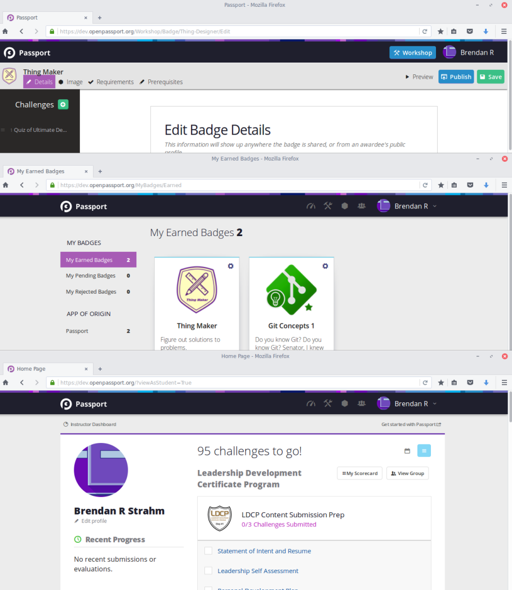
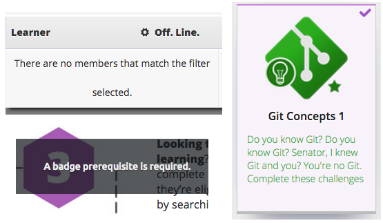

## Process

### Plan
Resources were not available at the time for doing interviews, card sorts, or usability testing with real users, so I proposed that I do a **cognitive walkthrough**. This allowed me to document specific ways that user research could benefit the project in the future.

Before I started, I documented my two major sources of bias:
- I had a close relationship with the developers of Passport and might be hesitant to overly criticize their work.
- Since I had recommended the walkthrough, I would be predisposed to find usability issues in order to justify the assessment.

### Understand
I went page-by-page through the site and recorded **points of confusion, frustration, excitement, or engagement**.  The application had a student-facing section and an instructor-facing section, so I did a walkthrough from the perspective of each type of user.

I encountered **a few types of issues**:
- Text with low contrast
- Poor information scent for new users
- Unexpected layout and styling changes between pages
- Unclear system messages
- Inconsistent styling on pages

	<figure style="top: -25em;">
		
		<figcaption>
			Examples of issues.  Unexpected layout and styling changes.
		</figcaption>
	</figure>

	<figure style="top: -3em;">
		
		<figcaption>
			Examples of issues.  Clockwise from top-left: Widowed text, low-contrast text, system messages without context.
		</figcaption>
	</figure>

## Outcomes
My final report included documentation of the issues and strengths I encountered in the walkthrough.  I also recommended performing an **open-ended card sort** to improve the information architecture of the site.

----

### Team
- Casey Wright- Team Lead
- Brendan Strahm - Front-end Designer/Developer
