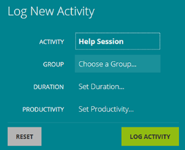
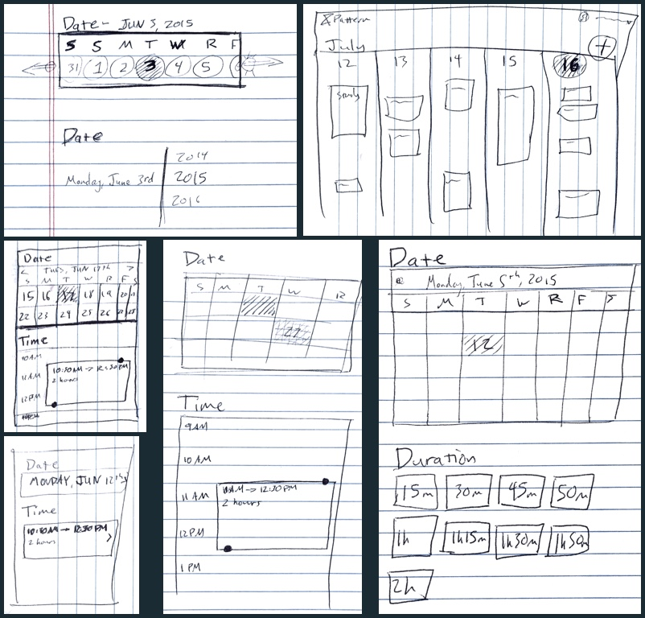
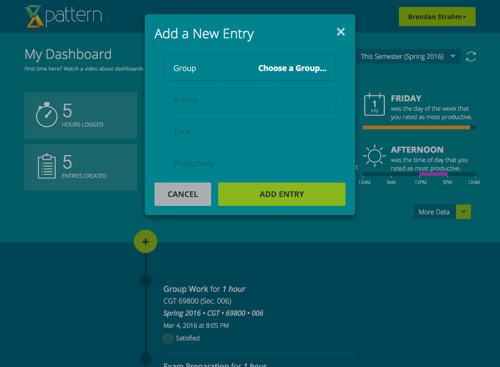
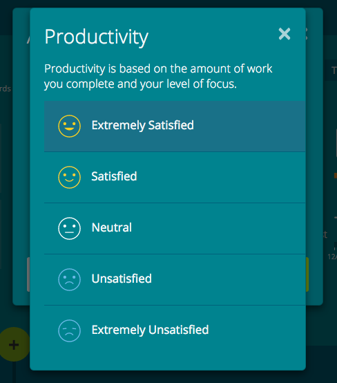
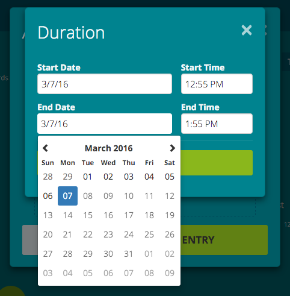
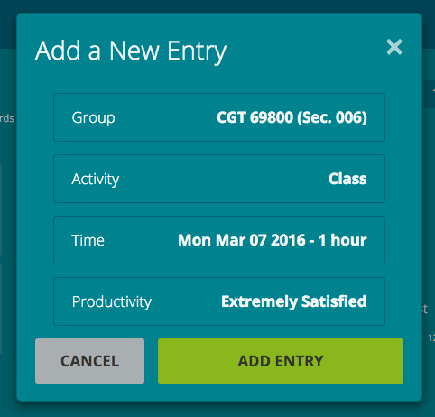

## Process

### Plan
The goal of this redesign was to reduce the number of clicks needed to get through the form. I reviewed the current design with the project lead to get a baseline for evaluating new designs.

### Understand
I looked at a report from our analytics of the time spent on each step of the current form design. The **date and time entry** was the most time-consuming, so I focused my efforts there. Reviewing UI pattern collections and Hoober's [*Designing Mobile Interfaces*](http://www.amazon.com/Designing-Mobile-Interfaces-Steven-Hoober/dp/1449394639) pointed me to **calendar event entry forms** as a comparable interface.

	<figure style="top: -10em;">
		
		<figcaption>
			The old form design
		</figcaption>
	</figure>

### Make
I sketched out some concepts and got feedback from the visual designer and product manager. I created prototypes of the most promising designs in Proto.io.

<figure>
	
	<figcaption>
		Some sketches of date and time interface concepts
	</figcaption>
</figure>

### Validate
I performed several rounds of hallway usability tests and found that the dragging and long presses in the calendar interface were too awkward to use quickly. I ended up with a similar layout to the original form, but with improvements in the flow to avoid pogo-stick navigation. I also defaulted the date and time fields to the previous hour, which was the most common date and time chosen by students.

The final design **reduced the number of clicks** needed to enter data to **six clicks** in the best case, including opening and closing the form.

	<figure style="top: -14em;">
		
		<figcaption>
			The empty form.  The 'Add Entry' plus button can be seen to the bottom left of the card
		</figcaption>
	</figure>

	<figure style="top: 2em;">
		
		<figcaption>
			Most sections had users pick from lists like this one
		</figcaption>
	</figure>

<figure>
	
	<figcaption>
		The date and time entry interface
	</figcaption>
</figure>

	<figure style="top: -4em;">
		
		<figcaption>
			A filled form ready to be submitted
		</figcaption>
	</figure>

## Outcomes
The final prototype was approved by my manager and I implemented it into our Angular-based web app and consulted on its implementation on iOS and Android.

This project took place when I was still trying to figure out how to be a UX advocate in an environment that didn’t have good practices in place.  In retrospect, I should have done usability tests with students throughout the iteration process either in addition to or instead of the hallway ones.  This project is one that prompted me to learn how to talk about the value of UX practices in terms of business outcomes and not just best practices.

----

### Team
- Alex Kingman - Project Lead
- Brendan Strahm - Front-end Designer / Developer
